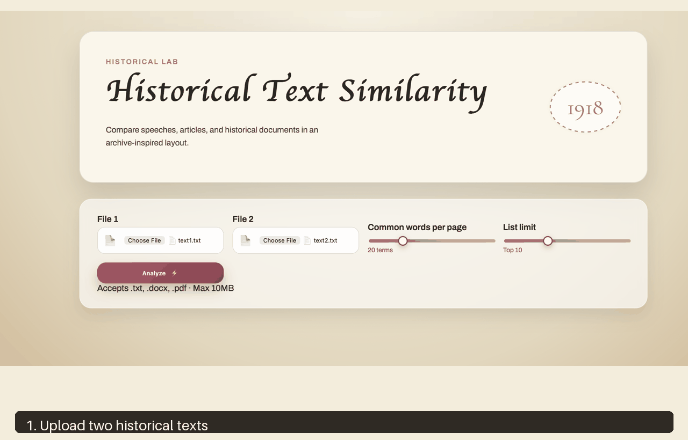

# Historical Text Analyzer (NLP + GUI + Web App)

A Python application for analyzing historical texts using Natural Language Processing techniques, featuring both a desktop GUI and a web interface.
This project focuses on analyzing historical narratives and detecting propaganda patterns using interpretable NLP techniques.

The project includes:
- a desktop GUI (Tkinter)
- a web application (Flask)
- multiple NLP analysis modules

It can compare texts, extract themes, detect propaganda patterns, and visualize results.

---

## Features

### Text Processing
- Supports `.txt`, `.docx`, `.pdf`
- Text cleaning and normalization
- Tokenization 
- Stop-word removal (custom + fallback)
- Lemmatization with spaCy, with a local fallback if the model is missing
- N-gram extraction for historical expressions

### NLP Analysis
- Jaccard similarity 
- TF-IDF cosine similarity
- TF-IDF with n-grams, sublinear TF scaling, max_df/min_df filtering
- Semantic cosine similarity with sentence-transformers embeddings
- Top words / common words / unique words
- Year extraction (historical timeline detection)
- Theme analysis (war, politics, revolution, etc.)
- Automatic topic modeling with LDA
- Named Entity Recognition for people, places, organizations, nations and events
- YAKE keyword extraction with frequency-ranked fallback
- Rule-based historical sentiment/framing analysis
- Historical interpretation summary for thematic, vocabulary and rhetorical differences

### Propaganda Detection
- Keyword-based classification
- ML classification with TF-IDF + Logistic Regression
- Rule-based classifier vs ML classifier comparison
- Propaganda vs neutral text scoring
- Density and ratio analysis
- Rhetorical markers: intensifiers, generalizations and polarization terms

### Interfaces
- Desktop GUI (Tkinter)
- Web app (Flask)
- File upload + folder-based processing

### Visualization
- Charts using Chart.js
- Highlighted terms
- Thematic distribution

---

## Screenshots

### Home Page


### Results Page


### Charts


### Propaganda Breakdown


### Highlighted Differences


### Demo GIF


---

## Project Structure
```bash
history-text/
│
├── main.py                  # Tkinter GUI application
├── analysis_service.py      # Core orchestration + caching
├── text_processing.py       # Text preprocessing
├── similarity.py            # Similarity + statistics
├── classification.py        # Propaganda detection
├── theme_analysis.py        # Theme scoring
├── themes.json              # Theme definitions
├── themes.py                # Fallback themes
├── stop_words.json          # Stop words
├── stop_words.py            # Fallback stop words
├── historical_interpretation.py # Historical interpretation summaries
├── data/                    # Example texts
├── tests/                   # pytest coverage
├── scripts/                 # Utility scripts
│
├── screenshots/             # Project images (README)
│   ├── home.png
│   ├── results.png
│   ├── charts.png
│   ├── propaganda.png
│   ├── highlight.png
│   └── demo.gif
│
├── web_app/
│   ├── app.py              # Flask app
│   ├── templates/          # HTML pages
│   └── static/
│       ├── images/         # UI images
│       └── styles.css
│
├── requirements.txt
├── requirements-dev.txt
├── pyproject.toml
├── LICENSE
└── README.md
```
---

## Installation

Clone the repository:
```bash
git clone https://github.com/your-username/history-text.git
cd history-text
```
Create a virtual environment:
```bash
python -m venv .venv
source .venv/bin/activate   # Mac/Linux
```
Install dependencies:
```bash
pip install -r requirements.txt
python -m spacy download en_core_web_sm
```

The application still runs without the larger NLP models, but advanced NER,
lemmatization and semantic similarity become stronger when they are installed.

Install development tools:
```bash
pip install -r requirements-dev.txt
black .
isort .
pytest
```

---

## How to Run

### Desktop App (GUI)

```bash
python main.py
```
- Select folder or files
- Run analysis
- View results in interface

### Web Application

```bash
cd web_app
python app.py
```
Then open in browser:
`http://127.0.0.1:5000`

---

## Example Capabilities
- Compare two historical texts (e.g., WW1 Romania vs Russia)
- Identify key terms and differences
- Extract important years (timeline)
- Detect dominant themes
- Highlight propaganda-related language
- Compare semantic similarity, not only word overlap
- Discover automatic topics and named entities
- Extract interpretable keywords and historical sentiment indicators
- Compare rule-based propaganda detection against an ML baseline
- Generate a short demo GIF from screenshots
  
---

## What I Learned
- Natural Language Processing pipelines
- Text preprocessing techniques
- Similarity metrics (Jaccard, TF-IDF, n-gram TF-IDF, embeddings)
- LDA topic modeling, NER, keyword extraction and lightweight ML classification
- Writing tests for NLP preprocessing and model outputs
- GUI development with Tkinter
- Web development with Flask
- Data visualization (Chart.js)
- Structuring a multi-module Python project

---

## Text Sources / Credits

The historical texts used for analysis:
- **Text 1 – Romania (World War I)
https://encyclopedia.1914-1918-online.net/article/romania-1-1/

- **Text 2 – Russia (War and Revolution, 1914–1921)
https://www.theworldwar.org/learn/educator-resource/war-and-revolution-russia-1914-1921

Used strictly for educational purposes.

---

## Image Credits

The interface images were replaced with public-domain or no-known-restrictions
files from Wikimedia Commons. Full per-file attribution is in
`web_app/static/images/IMAGE_SOURCES.md`.

---

## Possible Improvements

- Multi-text comparison
- REST API version
- Larger curated propaganda dataset for stronger ML evaluation
- Package refactor into `historical_text_analyzer/nlp`, `web`, `gui`, `data`

---

## Author

Alexandra Blaga
Computer Science Student

---

## License

MIT License. See `LICENSE`.
